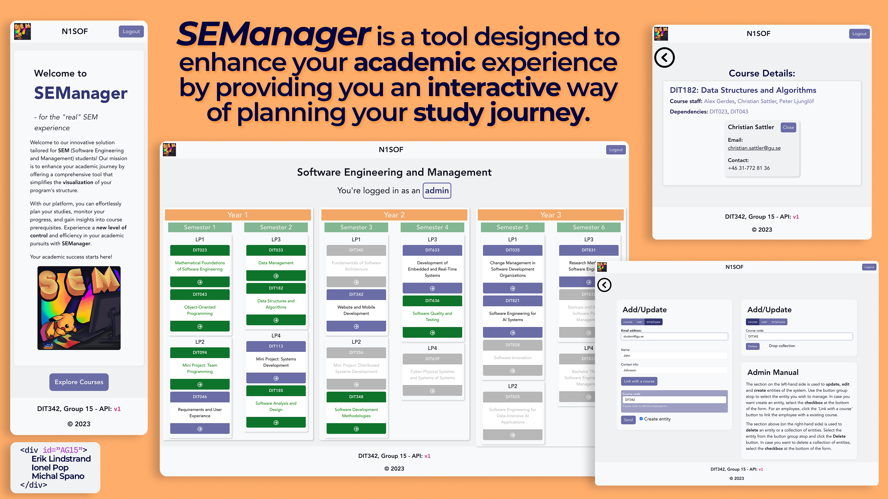

# Backend and Frontend Template

Latest version: https://git.chalmers.se/courses/dit342/group-00-web

This template refers to itself as `group-00-web`. In your project, use your group number in place of `00`.

## Project Structure

| File                                                 | Purpose                           | What you do?                              |
| ---------------------------------------------------- | --------------------------------- | ----------------------------------------- |
| `server/`                                            | Backend server code               | All your server code                      |
| [server/README.md](server/README.md)                 | Everything about the server       | **READ ME** carefully!                    |
| `client/`                                            | Frontend client code              | All your client code                      |
| [client/README.md](client/README.md)                 | Everything about the client       | **READ ME** carefully!                    |
| [docs/DEPLOYMENT.md](docs/DEPLOYMENT.md)             | Free online production deployment | Deploy your app online in production mode |
| [docs/LOCAL_DEPLOYMENT.md](docs/LOCAL_DEPLOYMENT.md) | Local production deployment       | Deploy your app local in production mode  |

## Requirements

The version numbers in brackets indicate the tested versions but feel free to use more recent versions.
You can also use alternative tools if you know how to configure them (e.g., Firefox instead of Chrome).

* [Git](https://git-scm.com/) (v2) => [installation instructions](https://www.atlassian.com/git/tutorials/install-git)
  * [Add your Git username and set your email](https://docs.gitlab.com/ce/gitlab-basics/start-using-git.html#add-your-git-username-and-set-your-email)
    * `git config --global user.name "YOUR_USERNAME"` => check `git config --global user.name`
    * `git config --global user.email "email@example.com"` => check `git config --global user.email`
  * > **Windows users**: We recommend to use the [Git Bash](https://www.atlassian.com/git/tutorials/git-bash) shell from your Git installation or the Bash shell from the [Windows Subsystem for Linux](https://docs.microsoft.com/en-us/windows/wsl/install-win10) to run all shell commands for this project.
* [Chalmers GitLab](https://git.chalmers.se/) => Login with your **Chalmers CID** choosing "Sign in with" **Chalmers Login**. (contact [support@chalmers.se](mailto:support@chalmers.se) if you don't have one)
  * DIT342 course group: https://git.chalmers.se/courses/dit342
  * [Setup SSH key with Gitlab](https://docs.gitlab.com/ee/ssh/)
    * Create an SSH key pair `ssh-keygen -t ed25519 -C "email@example.com"` (skip if you already have one)
    * Add your public SSH key to your Gitlab profile under https://git.chalmers.se/profile/keys
    * Make sure the email you use to commit is registered under https://git.chalmers.se/profile/emails
  * Checkout the [Backend-Frontend](https://git.chalmers.se/courses/dit342/group-00-web) template `git clone git@git.chalmers.se:courses/dit342/group-00-web.git`
* [Server Requirements](./server/README.md#Requirements)
* [Client Requirements](./client/README.md#Requirements)

## Getting started

```bash
# Clone repository
git clone git@git.chalmers.se:courses/dit342/group-00-web.git

# Change into the directory
cd group-00-web

# Setup backend
cd server && npm install
npm run dev

# Setup frontend
cd client && npm install
npm run serve
```

> Check out the detailed instructions for [backend](./server/README.md) and [frontend](./client/README.md).

## Visual Studio Code (VSCode)

Open the `server` and `client` in separate VSCode workspaces or open the combined [backend-frontend.code-workspace](./backend-frontend.code-workspace). Otherwise, workspace-specific settings don't work properly.

## System Definition (MS0)

### Purpose

Our project is focused on improving the experience of the `SEM` (Software Engineering and Management) students by providing a tool
that allows them to easily **visualize** the programme's structure.
This would allow the students to **plan** their studies, **track** their progress, and understand the **pre-requisites** of each course.
Furthermore, the users would also be able to interact with the course curriculum to **personalize their study plan**.
For instance, in the event that the student wants to take a study break, failed a course, is doing an exchange year, etc.

### Pages

The following section contains the description of the pages that will be implemented in the project.

#### Login screen

This page will be the first page that the user will see when accessing the website.
There's two possible scenarios: (i) guest user, and (ii) registered user.

A **guest** user will simply want to explore the program's structure and courses.
Therefore, the user will be able to access the main dashboard (home) without having to login.

A **registered** user will be able to access the main dashboard (home) with a personalized
experience based on the user's profile & preferences.

#### Main Dashboard (Home)

The **main dashboard** is a fundamental page of the website. It is essentially a much improved version of
the current **static** picture with the structure of the programme. The user will be able to interact with the
courses to highlight a **study path** and create a personalized *"study journey"*.

#### Course Page (Pop-up)

When the user clicks on a course, the application will display all the relevant **course information** such as
its study period, teaching staff, pre-requisites, etc. Herein, the user can mark a course as **completed**,
**in progress** or **failed**. They can similarly input their grade and other relevant information in regards to the course.

#### User Profile (Settings)

This page will contain the user's visual preferences for the tool (themes, animations, etc.) and other relevant
personal information.

### Entity-Relationship (ER) Diagram


## Teaser (MS3) [TODO]


