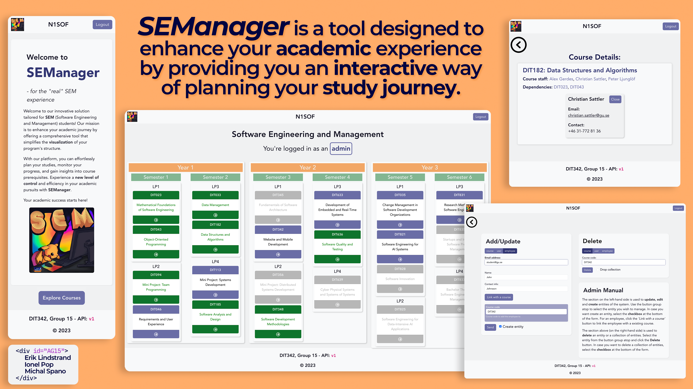

## Purpose

Our project is focused on improving the experience of the `SEM` (Software Engineering and Management) students by providing a tool
that allows them to easily **visualize** the programme's structure.
This would allow the students to **plan** their studies, **track** their progress, and understand the **pre-requisites** of each course.
Furthermore, the user is also be able to interact with the course curriculum to **personalize their study plan**.
For instance, in the event that the student wants to take a study break, failed a course, is doing an exchange year, etc.

### Login screen

This page will be the first page that the user will see when accessing the website.
There's two possible scenarios: (i) guest user, and (ii) registered user (i.e., student or an administrator). For now, the focus will be on the former; the guest user cannot access the main dashboard (home) without logging in (to prevent share of personal information).

### Main Dashboard (Home)

The **main dashboard** is a fundamental page of the website. It is essentially a much improved version of
the current **static** picture with the structure of the programme. The user will be able to interact with the
courses to highlight a **study path** and create a personalized *"study journey"*.

At each point in time, the user is unable to uncheck a course that has been marked as completed and the path is automatically updated to reflect the change. Furthermore, the user can also add a course to their study plan by clicking on the course and selecting the desired study period.

### Course Page

When the user clicks on a course, the application will display all the relevant **course information** such as the teaching staff and the pre-requisites. The user can navigate back to the dashboard or to another course that has a dependency on the current course.

### Employee Information (Pop-up)

Given a selected course, the user can click on the teaching staff to display their information. This will be displayed in a pop-up window centered on the screen. This pop-up contains additional information about the teacher. From there, the user can navigate back to the Main Dashboard or close the pop-up.

### Admin Page

A restricted page that is only accessible to the administrators. This page allows the administrators to add, update, remove entities to the system (see the ER diagram below). For instance, the administrator can add a new course, update the course information, remove a course from the system, or create an employee and assign them to a course.

The Admin page contains a component that serves the role of a **manual** to help the administrator to use the page. This component contains a description of the page and a list of all the possible actions that the administrator can perform.

---

### Entity-Relationship (ER) Diagram

